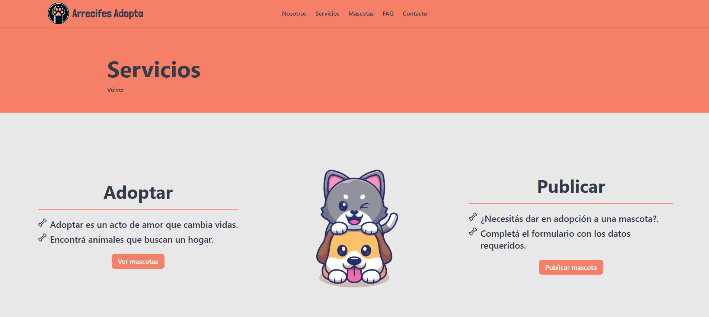
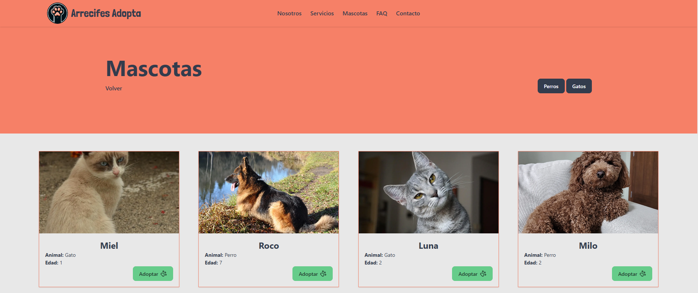

# Arrecifes Adopta

Proyecto en desarrollo.

## Qué es?

Arrecifes Adopta es una plataforma para adoptar o publicar mascotas.

## Qué ofrece?

- Los usuarios pueden adoptar o publicar una mascota completando un formulario.
- Una sección con las mascotas disponibles para adoptar.
- Publicación detallada con foto de la mascota y descripcion.
- Filtrar las mascotas por animal (Perro o Gato).

## Qué falta?

- Integrar base de datos.
- Panel de administración.

## Stack

- NextJS
- TypeScript
- TailwindCSS
- DaisyUI

## Diseño Responsive

Adaptable a cualquier dispositivo.

## Capturas

