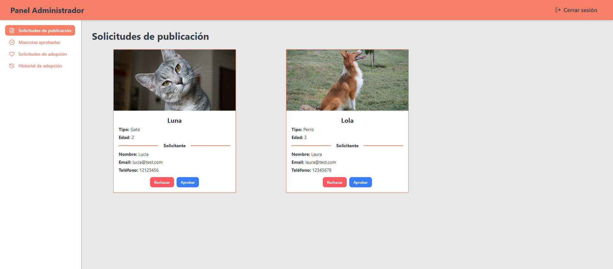

# Arrecifes Adopta

## Qué es?

Arrecifes Adopta es una plataforma para adoptar y publicar mascotas.

## Qué tiene?

- Los usuarios pueden adoptar y publicar una mascota completando un formulario.
- Una sección con las mascotas disponibles para adoptar.
- Publicación detallada con foto de la mascota y descripción.
- Filtrar las mascotas por animal (Perro o Gato).
- Panel de administración para gestionar las solicitudes.

## Cómo funciona?

Tanto para publicar como para adoptar, el usuario envía una solicitud completando un formulario que será aceptada o rechazada por un administrador desde el panel.

## Stack

- NextJS
- TypeScript
- Supabase
- TailwindCSS
- DaisyUI

## Diseño Responsive

Adaptable a cualquier dispositivo.

## Capturas

